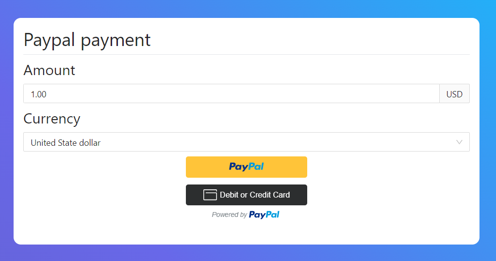

# Payment integration - Paypal ReactJS

## Instruction

For integrating Paypal payment system, we need to create an application on the paypal developer account. It provides a `CLIENT_ID` for your application. Please create your application and put the CLIENT_ID in the environment file by creating `.env` in root folder:

```bash
REACT_APP_PAYPAL_CLIENT_ID=<YOUR_CLIENT_ID>
```

Then, to get started, easily type:

```bash
$ npm start
```

## Gallery

**Demo link:** [Payment PayPal](https://payment-paypal.vercel.app/)

<p align="center">
  
</p>
<p align="center">
  <b>Frontend UI</b>
</p>

## Contribution

This demo is corresponding to [phuc16102001](https://github.com/phuc16102001). Please do not copy **without permission**!
